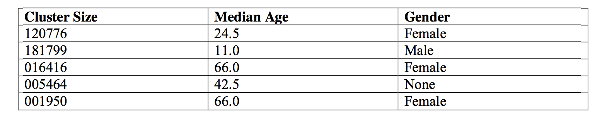
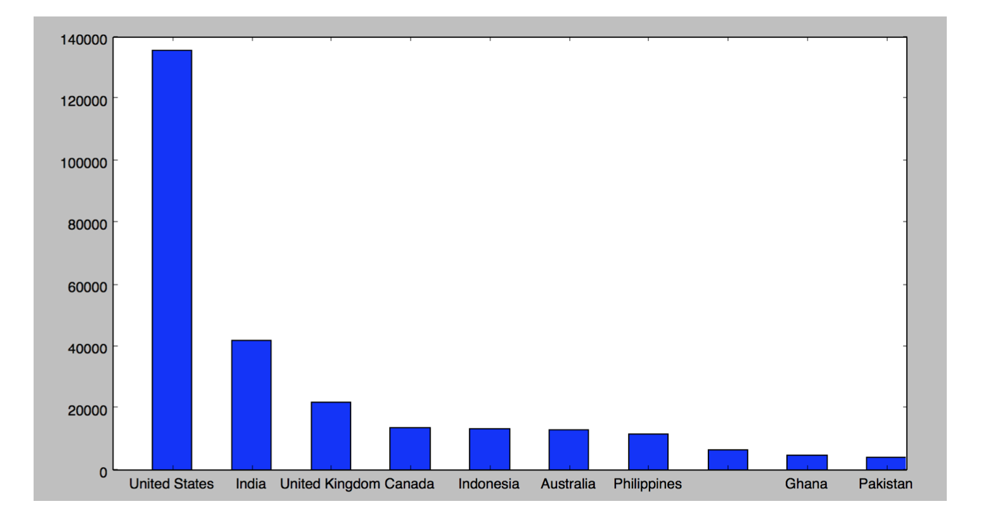
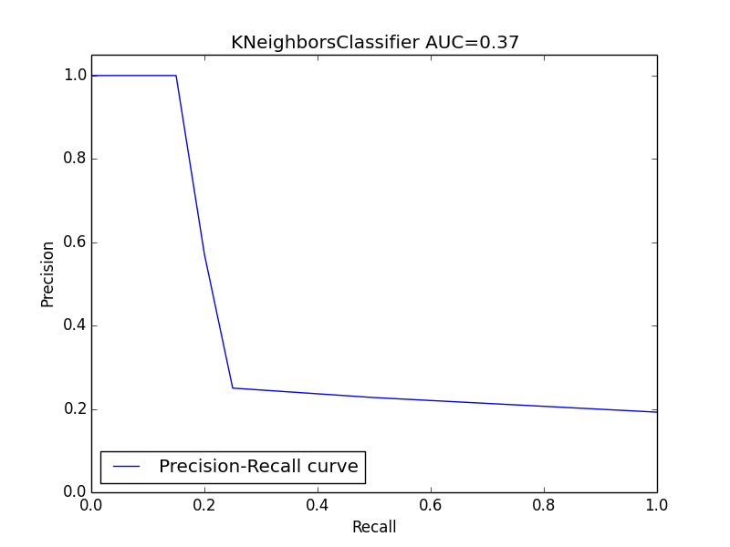
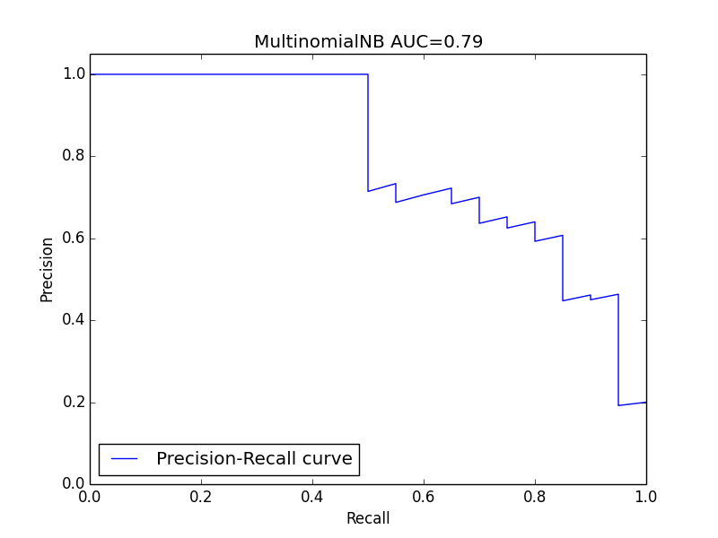
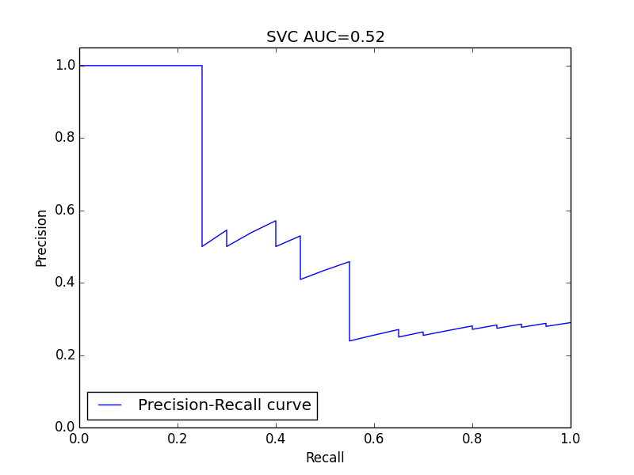
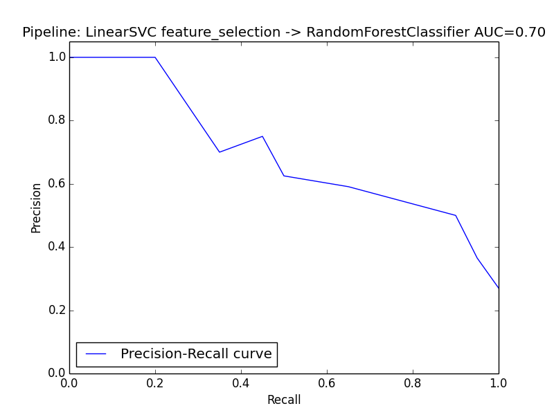
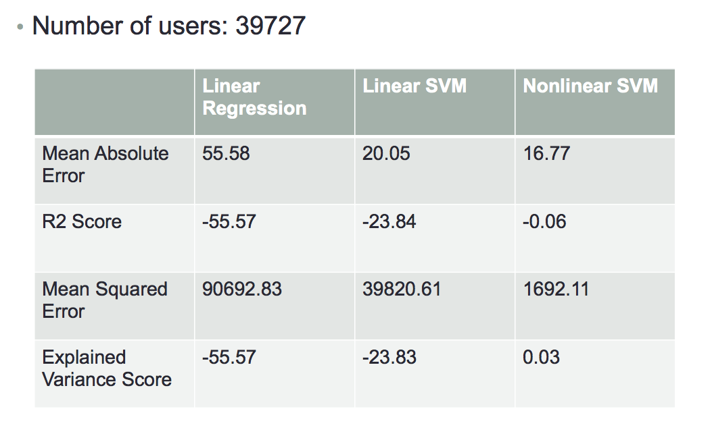

chatous
=======

This contains project work which uses chatous.com dataset for predicting quality of users and helps in predicting a better matching algorithm.

There are three different source files:

1. kmeans.py : This does the analysis of the dataset and tries to cluster the profiles into categories based on age and gender.

2. classification.py : This runs through various different classification algorithms and applies them on the dataset to find bad users based on their conversation patterns.

3. regression.py : This applies regression algorithms on conversation word vectors to predict the length of the conversation per user.

4. analysis.r is the code for truncated regression, where the true distribution of the dependent variable is regarded as a truncated distribution at zero. 

The code is built in python using the scikit-learn library. The preprocessed data set is divided into these files:

This is the chats database - so approximately 9 million conversations. The column format is as follows:

Chats Table
````
chat_id | first_user_id | second_user_id | first_user_profile_id | second_user_profile_id | timestamp_created_at |
timestamp_finished_at (null if chat is still open) | who_disconnected (null if no one disconnected) |
reported_id (null if no one reported) | reason  for report (null if no one reported) | first_user number_ lines |
second_user_number_lines | first_user_word_vector | second_user_word_vector
````

Profile table: Each row is a profile generated by a user, each column is a property of that profile
````
|Age| |Gender| |Location| |Location Flag| |Time created| |Profile ID| |User ID|
````

User classification table: Each row contains whether the user is clean/dirty/bot.
````
|user_id| status |
````

Data
-----

The data is offered by Chatous with granular information about the quality of a conversation (e.g. length of a chat), demographic information of the chatter (e.g. age, gender and location), and information about the underlying network. It also contains the user profile ID, which makes it possible to run a panel data analysis to control users’ heterogeneity.
A key metric for Chatous is the intention to talk, which can be measured approximately by the number of lines in a conversation (Lines). By comparing the number of lines of two users we can infer which user has more intention to talk. The goal of this analysis is to build a model to make the prediction, based on the demographic information of the users.

=======

User Statistics
---------------
We ran a k-means clustering algorithm on the profile data keeping age and gender as variables and got the table:  
Specifically males outnumber females in the network and the demographics also point to more teenage boys than girls in the networks. 

Some other statistics about the user profiles based on their country are given here:
. 
This points out that the demographic for the network is global with most number of members either in US, India or UK.


User Classification
-------------------
We got a hand-made manual set of 1034 users which were classified as either clean, dirty or bot. Using this data set and dividing it into training and test set; we tried to apply various classification algorithms in order to find out if we could learn to predict dirty/bot users and penalize them in the chat matching algorithm. We tried various different algorithms starting with k-neighbours to a pipeline combining more than one algorithm.

In the data set, the distribution is quite skewed; so instead of using the normal accuracy measure for calculating an algorithm's effectiveness, we used the Precision-Recall curves. We calculated the following metrics for every algorithm:

1. Precision recall curves

2. Number of false positives, false negatives, true positives, true negatives

3. Precision, Recall and F-score.

All the data about the different algorithms is present in the file: results/classification. The various plots are:

 
 
 


User Quality Regression
-----------------------
Besides this the other key parameter in matching users will be the quality of the user. The quality of the user is defined as the average length of conversations that a user does. If the user starts and maintains longer conversations, the user will get a better score. For doing this we also eliminated users who have not done a single conversation yet and were thus left with over 39727 users.

The signal that we used for learning was the word vectors that they had spoken till now. Based on the word vectors of their previous conversations till now we tried to learn a model with 70% of the user set and then use that to predict the quality on the rest of the 30% user base. We tried three different models: linear regresison, linear SVC and non-linear SVC with a exponential kernel.

The results were pretty much as expected with the non-linear support vector machine with exponential kernel performing really well. All the results are documented in results/regression.




Truncated Regression
--------------------

To illustrate the idea behind a truncated regression, imagine that we have a dataset with only two elements [-1,1] and we are interested in the average of the data. It is 0. Now assuming that the data is censored on the left at 0 and we only observe 1, calculation without adjustment will yield 1 instead, which is biased. Similarly, in Chatous dataset, it is unlikely to observe users with extremely low quality, because nobody would like to talk with them and thus researchers will not observe them in the dataset. To adjust this bias, we rely on truncated regression.

According to this method, the mean absolute error is 32.03. It is small than linear regression but larger than non linear regression, because in nature a truncated regression a special form of non linear regression with more assumptions on the process of generating and observing data.  

Mean absolute error: 32.03 with AUC = 0.59


Analysis of results
-------------------
Using the various different machine learning algorithms; we can build a better model for a matching algorithm which will result in better matches by suggesting users with higher quality for chats. We tried doing two different types of analysis: the first analysis to classify users as legitimate clean users and the other analysis to measure the length of conversation a user has as a proxy for user quality.

For the classification case, the hand-made data set was used. As the dataset was small, algorithms like SVM which require a large dataset did not even perform as well as naive bayes algorithm as mentioned in the graphs above. The ones that did the best were naive bayes and feature selection followed by random forest technique. Although, if we had more data we could probably do a lot better than the current set of estimates.

In the regression case, we could get good quality estimates using non-linear exponential kernel for SVM. We also tried other models such as linear regression and linear kernel SVM but they did not perform as well as the exponential kernel for SVM. With this model, we could predict how likely the user is to keep up a conversation based on their earlier conversations. The dataset was again extremely sparse here with nearly 50% of the example users having done just 1 chat.


Conclusion
----------
Using machine learning algorithms gives us a pretty good idea on the demographics of the users with clustering. Also with the help of curated data sets; we could build a convincing model to predict whether a user is clean or not. The regression model could also help predict user's inclination to talk based on their past conversational models even though the conversations are few and feature space is very sparse.
